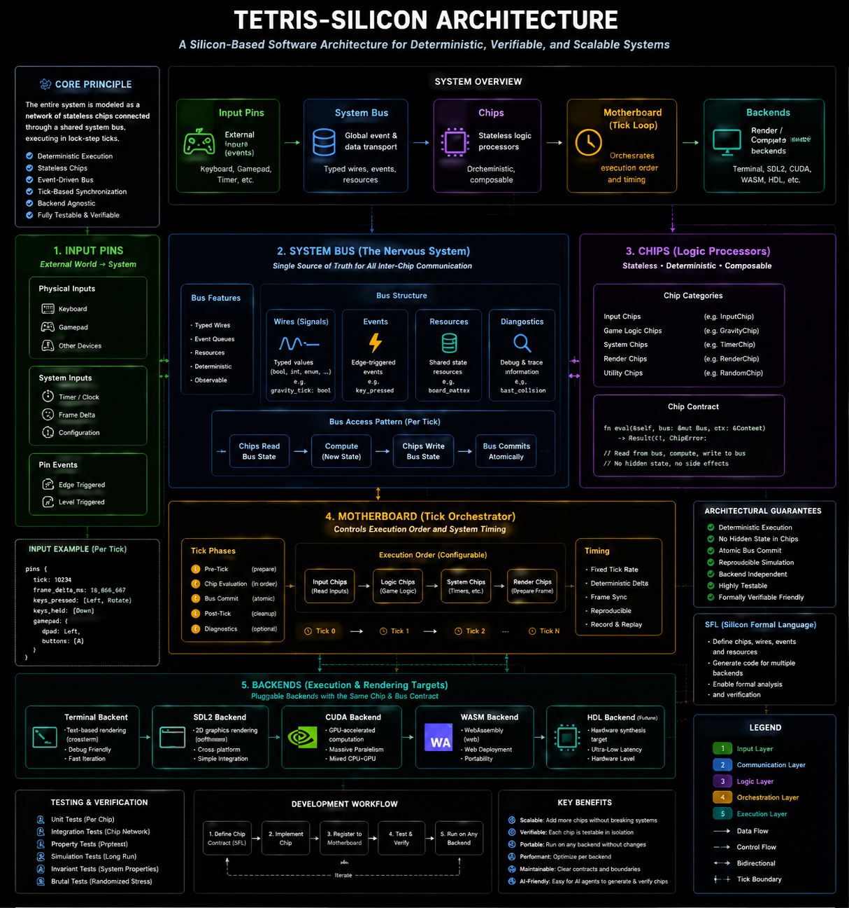

# Tetris Silicon（中文版）

基于 **Silicon-Based Software Architecture Paradigm** 的 Rust 终端版俄罗斯方块实现。

本项目不是用传统面向对象或回调密集的方式组织代码，而是把软件视作同步的数字电路：
- **输入引脚（Input Pins）** 采样外部信号
- 扁平的 **系统总线（System Bus）** 保存全部全局状态
- 无状态的 **逻辑芯片（Logic Chips）** 执行单一推理
- **主板时钟（Motherboard Clock）** 驱动确定性滴答

这种设计使代码高度确定、可推理，并对 AI 协同开发格外友好。

## 术语约定（全篇统一）

本说明文档统一使用以下术语：
- **输入引脚（Input Pins）**：仅表示当前 tick 采样得到的外部输入
- **系统总线（System Bus）**：全局状态载体，包含寄存器与导线
- **寄存器（Registers）**：跨 tick 持久保存的状态
- **导线（Wires）**：仅在当前 tick 有效、在 tick 开始时复位的瞬时信号
- **逻辑芯片（Logic Chips）**：无状态的状态变换单元
- **主板（Motherboard）**：按固定层序调度芯片的确定性执行器
- **滴答（Tick）**：一次完整的采样-传播-锁存循环

在讨论多后端可移植时，以 **SFL（Silicon Formal Language）** 作为语义真值来源，
Rust/C/CUDA/HDL 代码仅作为后端实现。
完整的多后端契约与边界定义见 [docs/architecture/SFL_CONTRACT.md](docs/architecture/SFL_CONTRACT.md)。

## 项目缘起

传统游戏工程常被深层对象图和隐式副作用缠绕，带来：
- 隐藏状态变化
- 难以重放的 bug
- 模块间强耦合
- 对人类与 AI 的高认知门槛

`tetris-silicon` 借鉴 FPGA/ASIC 设计思想，提出一种不同的组织方式以降低这些成本。

## 一页看懂 Silicon 范式

```text
External I/O -> InputPins (冻结快照)
                  |
                  v
        +-----------------------+
        |   SiliconMotherboard  |
        |  layer[0..N] pipeline |
        +-----------------------+
                  |
                  v
       SystemBus Registers + Wires
```

每个时钟滴答的生命周期：
1. **采样阶段**：将外部输入采样为 `InputPins`
2. **组合传播阶段**：芯片读取 `InputPins` 与 `SystemBus`，写入当前 tick 的 `Wires`
3. **时序锁存阶段**：主板提交 `Wires` 到长期寄存器，准备下一 tick

## 项目结构

主要文件：
- `src/bus.rs`：棋盘尺寸、时序常量、`InputPins`、`Wires`、`SystemBus`
- `src/chips/`：无状态芯片实现（`GravityTimer`、`Rotation`、`Movement` 等）
- `src/motherboard.rs`：芯片流水线与 `clock_tick` 驱动
- `src/main.rs`：墙钟循环、终端 I/O、渲染调度
- `src/tui.rs`：从 `SystemBus` 的纯渲染
- `src/terminal.rs`：非阻塞键盘轮询与 raw-mode 守护

项目遵循 `docs/architecture/SILICON_PARADIGM_SPEC.md` 中的规范。



## 为何这个范式有效

### 1) 由构造保证的确定性

全部状态集中在 `SystemBus`，每一次更新都发生在显式的时钟滴答上。
相同的输入序列与随机种子将产生相同的演化轨迹。

### 2) 无隐藏副作用

芯片之间不得互相调用，只通过总线字段通信。
数据流的拓扑与执行顺序是显式的。

### 3) 强单一职责

每个芯片做一件事，降低认知复杂度并简化局部更改。

### 4) 便于测试与形式化验证

天然契合仿真测试、模糊测试与不变量检查：
- 棋盘边界不变量
- 可确定重放的输入序列
- 基于 tick 的阶段断言

### 5) 对 AI 友好的上下文形状

- **上下文局部化**：`bus.rs` 即为全局契约
- **提示精确化**：任务可表述为明确的状态变换
- **安全组合**：新功能通常意味着新增或重新排列芯片，影响面小

## AI 驱动开发工作流（完整）

### A) 先定义契约

1. 扩展 `SystemBus` / `Wires` 的字段
2. 明确定义不变量（取值范围、生命周期、复位策略）
3. 字段命名尽量语义化（`*_requested`、`*_tick`、`*_expired`）

这让 AI 在本地上下文内正确生成代码变得更可靠。

### B) 无状态芯片生成

1. 要求 AI 实现单一职责芯片
2. 输入：`&InputPins`, `&mut SystemBus`；输出：仅修改 `SystemBus` 字段
3. 禁止跨芯片调用或隐藏状态
4. 保持可判定性

### C) 主板拓扑集成

1. 将芯片放入 `src/motherboard.rs` 的合适层
2. 验证上游信号在下游消费前可用
3. 在注释中记录顺序契约

### D) 基于时钟的验证

1. 围绕 `clock_tick` 写测验/属性测试
2. 用确定性 pin 序列做回放验证
3. 断言重要不变量

### E) 迭代式智能体循环

1. 更新总线契约
2. 生成芯片
3. 集成并跑测
4. 把回归用例加入测试集

每次迭代小而可验证，使复杂系统可被大量 AI 智能体并行“填充”。

## 数学验证与可证性

该范式天然可映射为有限状态机与函数组合。每个芯片 $C_i$ 是一个以冻结输入 $I_t$ 为参数的状态变换器：

$$C_i(I_t) : \text{SystemBus} \to \text{SystemBus}$$

> 注：Rust 实现中，芯片通过 `&mut SystemBus` 原地修改状态，而非返回新值。以上符号描述可观测效果，在同一 tick 内芯片不读取自己已写入的字段这一前提下与实际语义等价。

完整的 tick 是对流水线层的顺序折叠：

$$F(S_t, I_t) = C_n(I_t)\bigl(\cdots C_1(I_t)(S_t)\cdots\bigr)$$

系统不变量可表述为一阶谓词并用工具验证：
- 基于属性的测试（`proptest`）
- 有界模型检查（编译至 LLVM IR 后使用 KLEE / SeaHorn）
- 用 TLA⁺ / Alloy 建模并检验状态空间

完整的活性（liveness）与终止性证明需借助交互式定理证明器（Coq、Lean 4），这在理论上可行但工程量非平凡：带随机输入流（LCG）的反应式系统需要显式建模随机流，活性论证必须覆盖所有可能输入序列。

## 硅基形式化语言展望（Post-Rust Core）

### 目标

将该范式从“Rust 实现风格”升级为“语言无关的形式化规范层”。
Rust 变成后端之一，而不再是语义真值来源。

### 拟议核心：SFL（Silicon Formal Language）

SFL 作为声明式中间形式，统一定义：
- 总线模式（寄存器、wires、复位策略）
- 芯片契约（读集合、写集合、阶段语义、确定性约束）
- 主板拓扑（分层顺序、依赖边、禁止写冲突）
- tick 语义（采样、传播、锁存）的形式化迁移规则

系统的规范语义由 SFL 给出；Rust/C/CUDA/HDL 代码是后端实现。
关于“哪些代码属于核心语义、哪些属于后端适配、哪些必须显式降级或拒绝”，请参见 [docs/architecture/SFL_CONTRACT.md](docs/architecture/SFL_CONTRACT.md).

### 多后端目标

1. Rust 后端：安全参考实现与快速迭代主路径。
2. C 后端：获得更强可移植性与成熟编译/HLS 工具链。
3. CUDA 后端：并行芯片组与棋盘扫描核的 GPU 执行。
4. FPGA/ASIC 后端：对可综合内核进行 HLS/RTL 下沉。
5. 量子导向后端：接口层编排与可逆子集实验。

### 等价性要求

在相同输入流与初始状态下，各后端需满足相对 SFL 的语义等价：

$$\forall t\ge 0,\; \text{State}^{(backend)}_t = \text{State}^{(SFL)}_t$$

工程上建议通过以下机制落实：
- 跨后端差分仿真
- 共享回归 seed 与轨迹重放
- 芯片级与整 tick 级一致性测试套件

### 工程边界

- “一键生成任意后端”是长期目标，不是现阶段承诺。
- GPU/FPGA 下沉更适合先从计算密集、边界清晰的芯片子集开始。
- 量子方向当前主要是接口层可行；全系统量子化仍属前瞻研究。
- 在 SFL 与一致性工具链成熟前，Rust 仍是主验证载体。

## 编译器作为局部设计规则检查器

针对 Rust 后端：

| 物理规则 | 执行机制 |
|---|---|
| 同一 tick 不得两个芯片同时写总线 | `rustc`：独占 `&mut SystemBus` 引用 |
| `InputPins` 在 tick 期间只读 | `rustc`：`&InputPins` 不可变借用 |
| `Wires` 每帧重置（短暂信号） | **仅为运行时约定**，由 `clock_tick` 开头的 `bus.wires = Wires::default()` 保证；编译器不强制此约定 |
| 芯片不携带隐藏状态 | `rustc`：零字段单元结构体；`LogicChip` trait 无 `&mut self` |

`rustc` 因此是局部 DRC（设计规则检查）——它从结构上消除了一整类时序违规与别名 bug，但**不**验证业务逻辑正确性。

## 优化与硬件化前景

- **自动并行**：可从芯片对总线的读写依赖中提取并行化机会（需工具支持）
- **LLVM 极限优化**：通过 LTO 与单个 codegen unit，可把 tick 内联以利编译器优化。tick 期间无堆分配（流水线 `Vec<Vec<Chip>>` 仅在启动时分配一次）
- **HLS（到 FPGA/ASIC）**：概念上贴合，但需 Rust→C 的转译 + 硬件时序与资源注解，工程上仍有障碍

## 量子计算相关前瞻

| 方向 | 可行性 | 时间线 | 障碍 |
|---|---|---|---|
| QPU 反馈循环的经典编排控制器 | 高 | 现在 | 无，纯设计工作 |
| 可逆芯片编译为量子门序列 | 中（仅部分芯片） | 2–5 年 | 需要重新设计芯片以保留辅助比特 |
| 量子子程序作为芯片替换 | 低（游戏域） | 5–15 年 | QPU 延迟与量子比特规模限制 |
| 全系统量子执行 | 不适用 | — | 计算模型根本不同 |

## 工程诚实评估

| 主张 | 结论 | 说明 |
|---|---|---|
| AI 芯片生成准确率高 | **条件成立** | 无状态、单职责的提示显著降低幻觉面；正确性仍需测试验证 |
| `rustc` 可替代人工审查 | **部分成立** | 消除别名/内存/类型 bug；不验证业务逻辑 |
| 确定性回放有保证 | **条件成立** | 相同输入序列 + 相同初始 `SystemBus`（含 `prng_state`）可保证；目前随机种子硬编码，尚无注入接口 |
| 自动并行已解锁 | **潜力，非自动** | DAG 结构支持分析；需工具提取与利用 |
| LLVM 产出接近最优机器码 | **LTO 下成立** | 单态化、滴答内无堆分配、可内联；标准发布配置已受益 |
| HLS 到芯片是近期路径 | **否** | 概念对齐但需 Rust→C 转译和硬件注解 |
| 量子计算集成可行 | **在接口层部分可行** | 经典编排现在就能做；芯片级量子替换是长期展望 |
| 该范式消除所有 bug | **否** | 消除结构性/并发 bug；业务逻辑 bug 依然存在，需测试与形式方法兜底 |

## 战略愿景（工程化校准版）

以下愿景方向值得推进，但必须加上边界条件，才能保持工程可落地。

### 1）Silicon Compiler / Auto-Synthesis 工具链

**愿景**：基于 Rust `syn`/`quote` + 依赖图分析器，读取总线契约后实现芯片生成与自动接线。

**可行性评估**：
- 代码生成、静态检查、主板集成脚手架：高
- 在无人审查下自动保证芯片正确性：中

**当前可实现**：
- 解析芯片 AST，提取总线字段读写集合
- 构建芯片依赖 DAG，检测写冲突与拓扑风险
- 按依赖自动建议 `motherboard` 分层插入位置
- 依据总线契约生成芯片模板

**当前不现实**：
- "一句提示词，大规模自动生成且直接正确"（无测试/证明门禁）
- 数千上万智能体并发后无需冲突仲裁即可自动合并

**近期里程碑（0-6 个月）**：
1. `chip-analyzer`：读写依赖图提取
2. `chip-linter`：字段权限边界检查
3. `chip-scaffold`：提示词到模板代码生成
4. `auto-layerer`：确定性分层建议 + 冲突报告

### 2）形式验证 + Provable Software 闭环

**愿景**：在游戏、交易引擎、自动驾驶内核、区块链 VM 子系统中提供可数学论证的核心逻辑。

**可行性评估**：
- 安全不变量与有界正确性：高
- 完整活性/进度证明：中
- "整系统数学上无 bug" 作为统一承诺：低

**工程事实**：
- "可证明无 bug" 必须相对于形式化规范与假设条件
- 实务中更常达到的是"关键不变量可证明 + 行为经系统测试"

**建议闭环**：
1. 形式化总线不变量（TLA+ / Alloy / 定理证明器）
2. 在 CI 中强制属性测试与回归种子
3. 对关键芯片簇启用有界模型检查
4. 对安全关键字段设置 proof obligation 发布门禁

### 3）异构硅基系统（Heterogeneous Silicon System）

**愿景**：在统一硅基合约下，把不同芯片分发到异构后端（CPU 标量、SIMD、GPU、FPGA/HLS 候选、远端加速器）。

**可行性评估**：
- CPU/SIMD/GPU 混合执行：高
- 关键内核 FPGA 卸载：中
- 全系统透明异构调度且无运行时约束：低

**关键约束**：
- 后端边界必须保持滴答级确定性语义
- 跨设备延迟必须满足时钟预算
- 数据搬运开销可能超过计算收益

**近期里程碑（0-12 个月）**：
1. 定义后端无关的芯片 ABI（输入/输出/确定性契约）
2. 实现 CPU 基线版本 + SIMD 棋盘扫描核
3. 对可并行分析任务尝试 GPU 原型
4. 构建跨后端确定性一致性基准

### 4）AI-Native 全流程平台化

**愿景**：将契约编写、芯片生成、依赖分析、验证、仿真与安全合并编排平台化。

**可行性评估**：
- 研发效率和一致性提升：高
- 在安全关键域实现全自动闭环：中

**必要护栏**：
- 策略层：芯片字段级写权限
- 验证层：测试/证明作为合并门禁
- 可追溯层：每个生成芯片关联提示词、模型版本、测试/证明工件
- 回滚层：失败不变量的确定性重放与自动二分定位

**成功标准**：
不是"零人工参与"，而是可量化地缩短交付周期，同时保持或改善缺陷密度与线上事故率。

## 运行与开发

运行：

```bash
cargo run --release
```

可选 CUDA 后端（最小集成路径）：

```bash
cargo run --release --features cuda
```

```bash
TETRIS_BACKEND=cuda cargo run --release --features cuda
```

CUDA 芯片路由策略（契约对齐的混合执行）：

全部 15 个芯片都可以通过 CUDA 后端执行：
- **4 个芯片**有 GPU kernel 实现（CollisionDetector、LineClearDetector、GhostComputer、Rotation）
- **11 个芯片**通过 `LogicChip` trait 在 CPU 上执行（自动降级，无 GPU kernel）

已实现的优化：
- **P0（ghost_y_scan）**：GPU 向下扫描内核，一次计算出 ghost Y，减少主机↔设备往返和逐次检查开销。
- **P1（batch_kick_test）**：GPU 内核并行评估 5 个墙踢偏移，返回紧凑结果（位掩码/索引），可在不逐次主机调用的情况下完成旋转解析。
- **P2（持久设备棋盘）**：设备端驻留棋盘并带有 `board_synced` 标志，使用惰性上传语义；CPU 侧对棋盘的变更会显式使该标志失效以避免设备读取陈旧状态。

CUDA 后端接口边界（与 SFL 契约对齐）：
- 后端代码只允许使用芯片接口与能力元数据（`ChipId`、路由计划、`LogicChip::tick`）
- 后端代码不得依赖芯片内部结构
- 无 GPU kernel 的芯片统一经 `LogicChip::tick` 在 CPU 执行

```bash
# 默认：全部芯片启用，GPU kernel 在 GPU 上运行，其余芯片在 CPU 上运行
TETRIS_BACKEND=cuda cargo run --release --features cuda

# 所有芯片都走 CPU（仍保留 CUDA 运行时选择路径）
TETRIS_BACKEND=cuda TETRIS_CUDA_CHIPS=none cargo run --release --features cuda

# 仅 GPU kernel 芯片（3 个）
TETRIS_BACKEND=cuda TETRIS_CUDA_CHIPS=CollisionDetector,LineClearDetector,GhostComputer cargo run --release --features cuda

# 自定义列表（逗号分隔芯片名；未列出的芯片在 CPU 上运行）
TETRIS_BACKEND=cuda TETRIS_CUDA_CHIPS=CollisionDetector,GhostComputer cargo run --release --features cuda
```

`TETRIS_CUDA_CHIPS` 模式：
- `contract`：默认策略（启用全部 15 个芯片）
- `all`：对全部芯片启用“CUDA 路径”（无 kernel 芯片仍经 trait 在 CPU 执行）
- `none`：全部芯片强制 CPU
- `chip1,chip2,...`：仅对列出的芯片启用 CUDA 路由计划

如果运行时 CUDA 不可用，系统会自动回退到 CPU。

操作键位：
- 左右移动：`Left/Right` 或 `h/l`
- 软降：`Down` 或 `j`
- 顺时针旋转：`Up` 或 `x`
- 逆时针旋转：`z`
- 暂存：`c`
- 硬降：`Space`
- 退出：`Esc`

开发命令：

```bash
cargo fmt
cargo clippy --all-targets --all-features -- -D warnings
cargo test
```

## 路线图（建议）

- 用 7-bag 替换 LCG，同样保留可注入 seed
- 提供 headless 环境 API（`reset/step`）以便 RL 使用
- 引入 bitboard 表示以便高速仿真
- 编写 TLA⁺ 规格和属性测试套件
- 为关键芯片添加基于属性的回归测试套件
- 实现 `chip-analyzer` + `auto-layerer` 作为 Silicon Compiler 首批模块
- 增加后端无关 chip ABI 与跨后端确定性一致性测试
- 为 AI 生成芯片建立工件追溯（prompt/模型/测试证明）

## 许可证

MIT — 详见 [LICENSE](LICENSE)。

